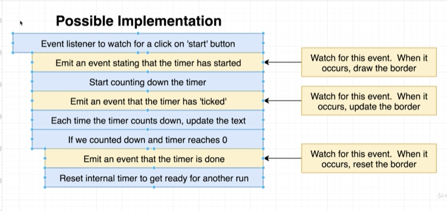
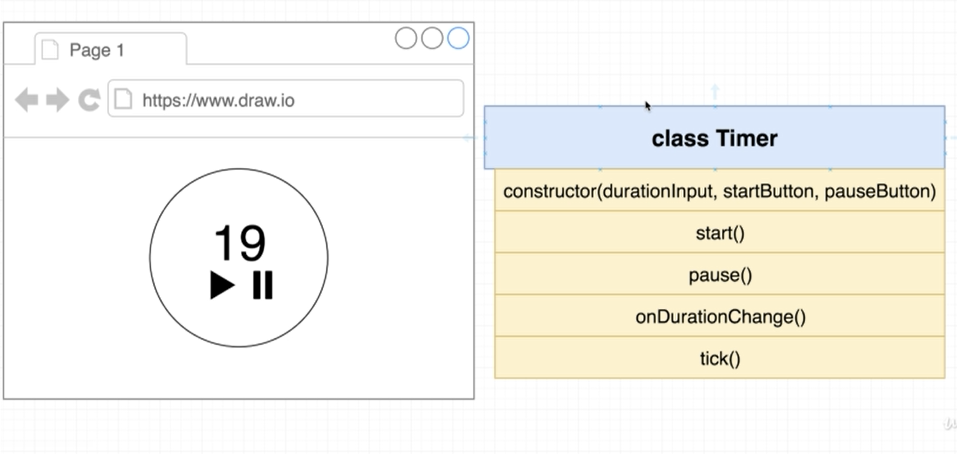
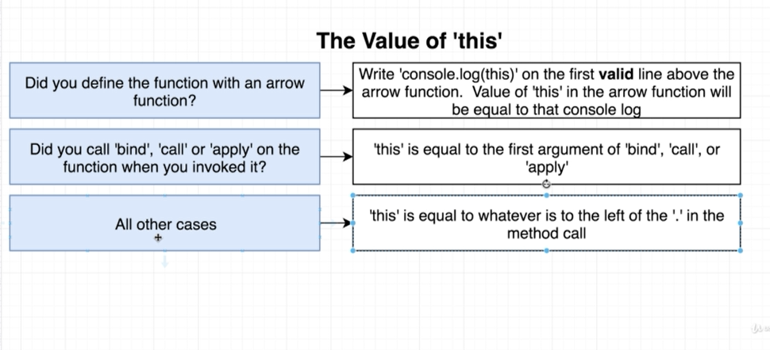

# 🔥Timer

> In this application, we are going to learn about **Drawing Animations**

## ⚡Architecture

### ✳Architecture



### ✳Implementation



## ⚡Concepts Learned

### ✳How to determine value of **this**?



### ✳How to call getter and setter methods in javascript?

```js
	tick = () => {
        //Calling Getter Method
        const timeRemaining = this.timeRemaining;
        //Calling Setter Method
        this.timeRemaining = timeRemaining - 1;
        //Shortform (Setter = Getter - 1)
        this.timeRemaining = this.timeRemaining - 1;
	};

	get timeRemaining() {
		return parseFloat(this.durationInput.value);
	}

	set timeRemaining(time) {
		this.durationInput.value = time;
	}
```

[🌐 getter Documentation](https://developer.mozilla.org/en-US/docs/Web/JavaScript/Reference/Functions/get)

[🌐 setter Documentation](https://developer.mozilla.org/en-US/docs/Web/JavaScript/Reference/Functions/set)

### ✳How to draw SVG and what are attributes if svg?

```html
<svg height="400" width="400">

</svg>
```

[🌐 MDN Documentation](https://developer.mozilla.org/en-US/docs/Web/SVG/Attribute)

### ✳How to draw circle inside svg and what are attributes if circle?

```css
<svg height="400" width="400">
	<circle
		r="190"
		cx="200"
		cy="200"
		fill="transparent"
		stroke="blue"
		stroke-width="15"
		stroke-dasharray="565"
		stroke-dashoffset="-10"
		transform="rotate(-90 100 100)"
	/>
</svg>
```

[🌐 MDN Documentation](https://developer.mozilla.org/en-US/docs/Web/SVG/Element/circle)
